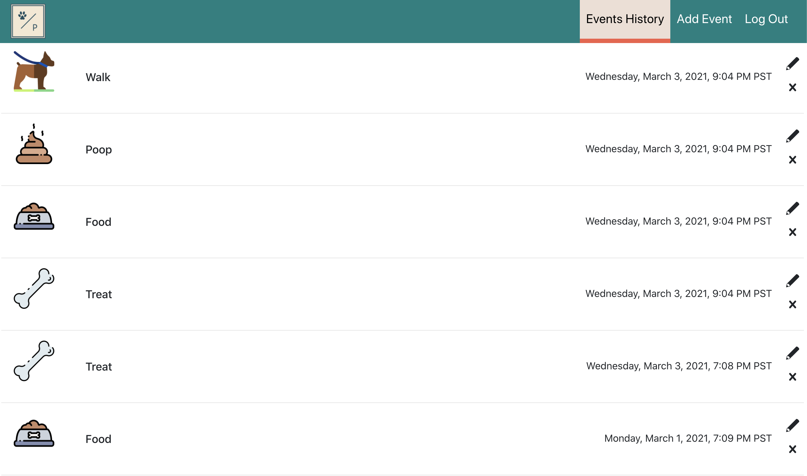

## Introduction
Tracking your pet's activities has never been easier! PawPrint introduces a logging system to keep track of feeding time, treats, walkies, and everything in between.

## Demo
Live demo: [https://react-pawprint.herokuapp.com/](https://react-pawprint.herokuapp.com/)

## Features
- Optimistic UI Rendering to enhance user experience 🎉
- Authentication to keep your pet's logs private
- Ability to add comments to each activity
- Modify existing activties' comments and timestamp

## Technologies & Plugins
- Frontend: React.js
- Backend: Firebase
- [react-bootstrap](https://www.npmjs.com/package/react-bootstrap)

## Usage

